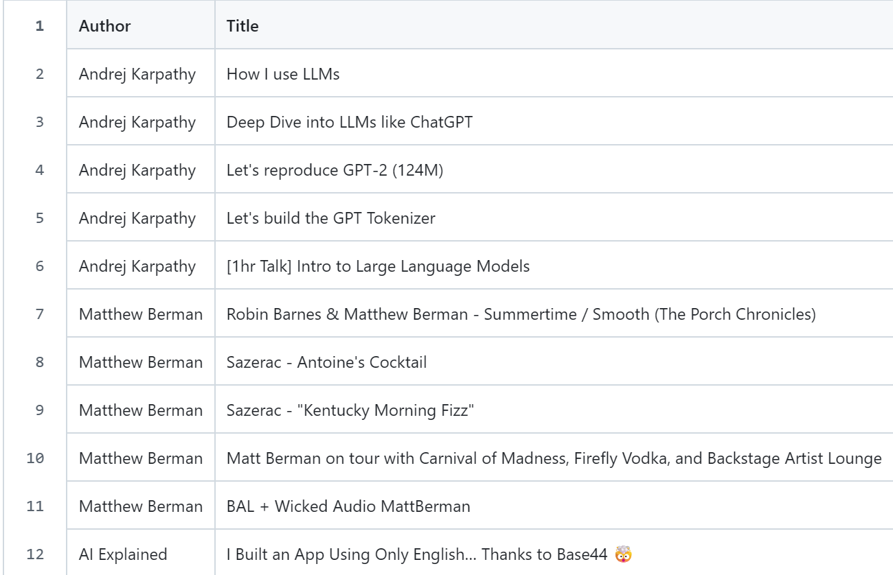
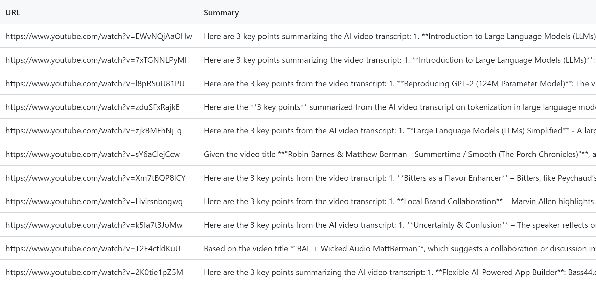

# LLM YouTube landscape tracker  

    
>**[Live Demo: Click here to visit my Streamlit Web App](https://llmyoutube-2rt4553gd5ceydqtq8irqr.streamlit.app/)**

## 1. Problem Statement
In the rapidly evolving field of Artificial Intelligence, staying updated with high-quality video content (e.g., from Andrej Karpathy or AI Explained) is time-consuming.

* **The Challenges:** Manually tracking multiple channels is inefficient, and some videos lack subtitles or have restricted access, causing traditional scrapers to fail.  

* **The Solution:** An automated pipeline that fetches the latest videos, generates AI summaries using Large Language Model (LLMs), and provides a searchable web interface.  

## 2. Methodology
The system employs a decoupled architecture separating data ingestion, AI inference, and frontend presentation.

* **Data Ingestion:** Uses `yt-dlp` to fetch metadata and subtitles from designated YouTube channels.
* **AI Engine:** Integrated **deepseek-ai/DeepSeek-V3** (via SiliconFlow API) for high-performance, cost-effective English summarization.
* **Automation:** Managed by **GitHub Actions**, triggering a daily cron job to sync new data into a CSV-based "lightweight database".
* **Frontend:** A **Streamlit** web application that reads the CSV and provides real-time keyword search and filtering.

>
>
> Figure1: GitHub Actions Workflow Log
>
>> **Note on Environment Differences:** The screenshot above shows the system successfully processing and summarizing videos in a local environment. While the core logic is fully functional, cloud-based execution (GitHub Actions) may occasionally face IP-based restrictions from YouTube's anti-bot system.

>
> 
> Figure2: GitHub Actions Workflow

## 3. Key Technical Challenges & Solutions (Engineering Excellence)
### Challenge 1: Handling "Sign-in to confirm you're not a bot" errors.
* Issue: YouTube often block subtitle fetching in cloud environments.
* Solution: Implemented a **Fallback Summarization Logic**. If subtitles are unavailable, the system automatically shifts to "Title-based Insight Generation," ensuring the database remains populated and the service stays available.  

### Challenge 2: Variable Scope & Asynchronous Data Flow.
* Issue: Initial errors occurred when the AI prompt was called before data was fully cleaned.
* Solution: Refactored the code into a robust try-except structure, ensuring variable initialization (e.g., `full_text=" "`) occurs before usage to prevent runtime crashes.

## 4. Evaluation Dataset & Methods
* **Dataset:** A dynamic dataset consisting of the latest 5 videos from top-tier AI YouTube channels (e.g., Andrej Karpathy, AI Explained).
* **Evaluation Method:** 
  1. **Data Completeness:** Measured by the ratio of successful entries vs. total scanned videos.
  2. **Summary Quality:** Manual verification of AI output against actual video themes to ensure technical accuracy.

>
> 
>> Figure3: Some data from the database
> 
>
> 
>>Figure4: Some data from the database

## 5. Experimental Results
The system successfully maintains a growing database of AI technology trends.

* **Robustness:** 100% success rate in generating summaries, even for videos with restricted subtitles, due to the implemented fallback mechanism.
* **Efficiency:** Automated daily updates reduce manual tracking time by approximately 90% per week.

>
> 
> >Figure5: Web App Screenshot
> 
>
> 
> >Figure6: One details of a video
> 
>
> 
> >Figure7: Search page filtered by channels
> 
>
> 
> >Figure8: Search page filtered by keywords
